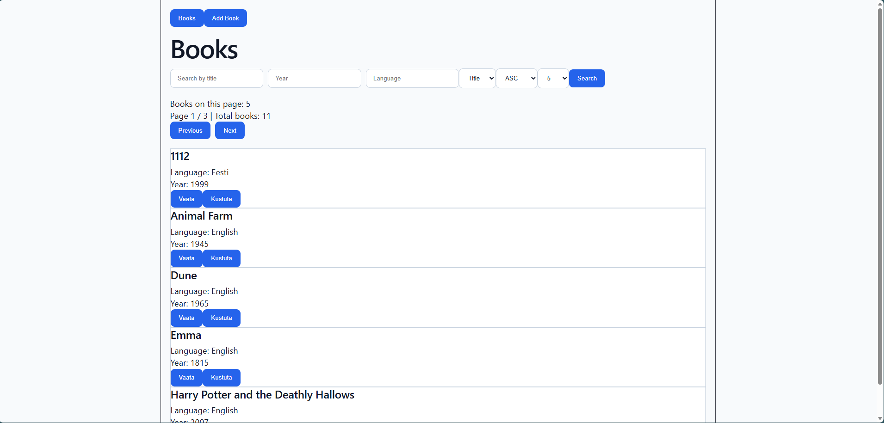
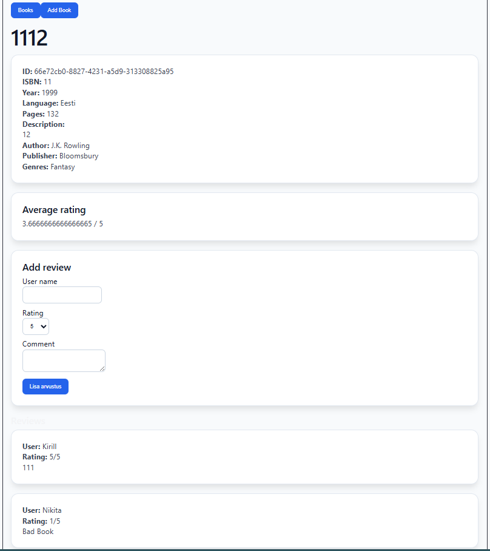
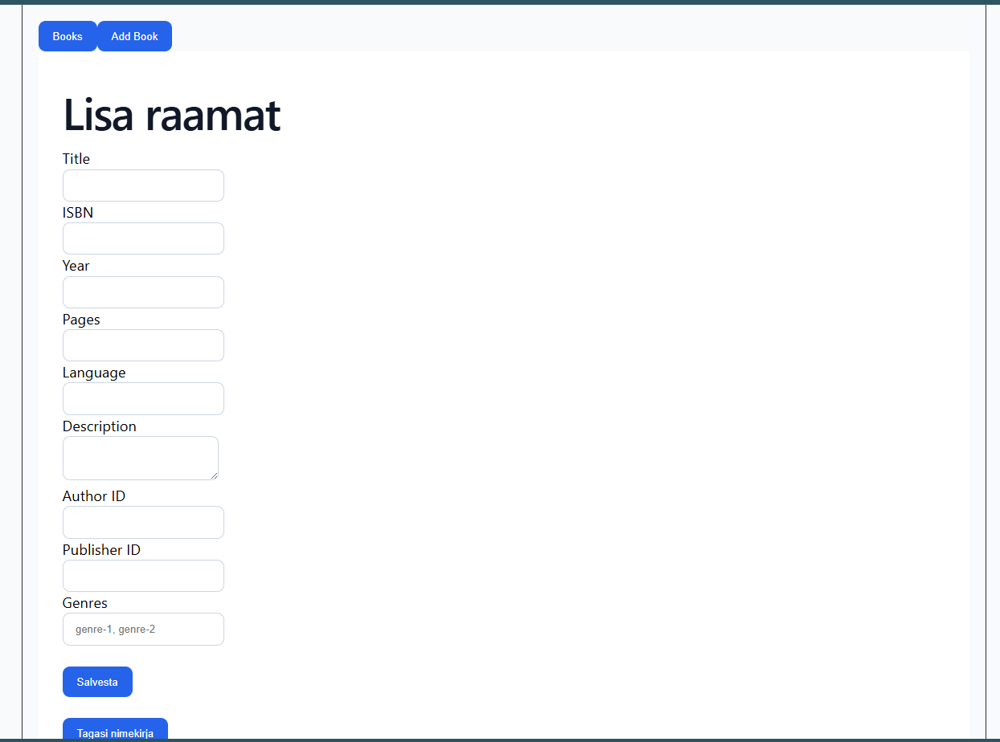
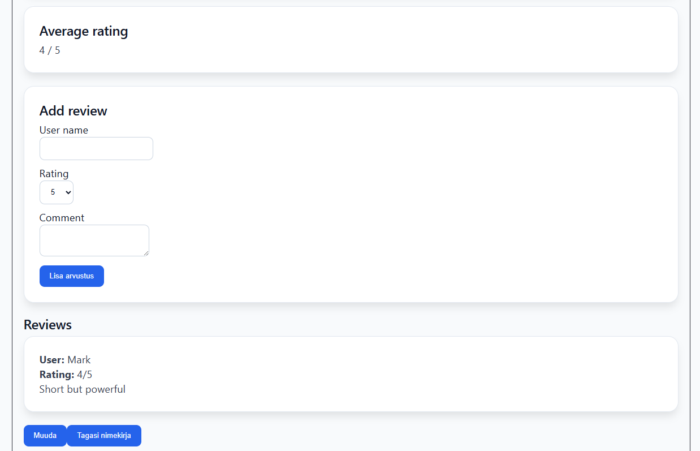

# Book Library Frontend

Frontend application for the Book Library project.

The application provides a user interface for managing books, reviews, ratings, filtering, sorting, and pagination.

Built using React, TypeScript, Vite, React Router, and Axios.

---

## Features

- View all books
- Search books by title
- Filter books by language and year
- Sort books by title or year
- Pagination support
- View detailed information about a book
- Add new books
- Edit existing books
- Delete books
- Add reviews and ratings
- Display average rating
- Responsive and modern UI

---

## Tech Stack

- React
- TypeScript
- Vite
- React Router DOM
- Axios
- CSS

---

## Prerequisites

Before running the frontend project, make sure you have installed:

- Node.js (version 18 or higher)
- npm

Verify installation:

```bash
node --version
npm --version
```

## Setup Instructions

1. Open the project folder:

```bash
cd frontend
```

2. Install dependencies:

```bash
npm install
```

3. Start development server:

```bash
npm run dev
```

The frontend will run on:

```text
http://localhost:5173
```

---

## Backend Connection

The frontend communicates with the backend REST API.

Make sure the backend server is running before starting the frontend.

The frontend uses the environment variable `VITE_API_URL` to configure the base API URL.

Example `.env` entry:

```env
VITE_API_URL=http://localhost:3000/api/v1
```

---

## Pages

### Books Page
- Display all books
- Search by title
- Filter by language and year
- Sort by title or year
- Pagination
- Navigate to book details

### Book Details Page
- Full book information
- Reviews list
- Average rating
- Add review form

### Add Book Page
- Create a new book

### Edit Book Page
- Update existing book

---

## Project Structure

```text
frontend/
├── src/
│   ├── api.ts
│   ├── main.tsx
│   ├── App.tsx
│   ├── components/
│   │   ├── Navbar.tsx
│   │   └── BookCard.tsx
│   ├── pages/
│   │   ├── BooksPage.tsx
│   │   ├── BookDetailPage.tsx
│   │   ├── AddBookPage.tsx
│   │   └── EditBookPage.tsx
│   └── index.css
├── package.json
└── README.md
```

---

## Backend Endpoints Used

- `GET /books`
- `GET /books/:id`
- `POST /books`
- `PUT /books/:id`
- `DELETE /books/:id`
- `POST /books/:bookId/reviews`
- `GET /books/:bookId/reviews`
- `GET /books/:bookId/average-rating`
---

## UI Highlights

- Reusable book cards
- Navbar navigation
- Styled buttons and forms
- Responsive layout
- Card-based design
- Loading and error states

---

## AI Usage

AI tools were used during development for:

- React component structure
- Debugging TypeScript errors
- Styling improvements
- Pagination logic
- Filtering and sorting logic
- Axios integration
- React Router configuration

AI was used only as a support tool.
---

## Screenshots






---

## Notes

- The frontend currently relies on the backend running at the configured `VITE_API_URL`.
- Search and filtering are handled through the `/books` endpoint.

---

## Author

Maksim Ljubimov
